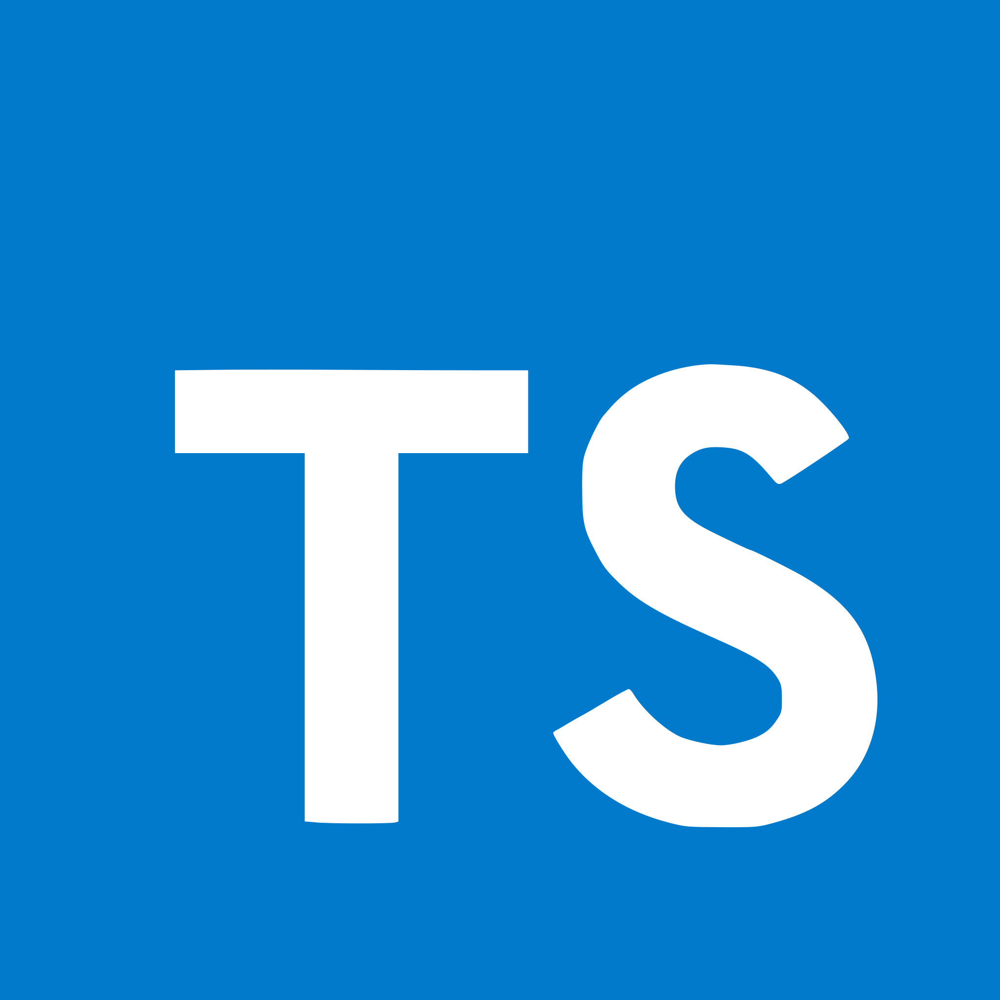

# Example Project

The idea of this project is to be a proof of concept for starting a web app with all the developer tools you would require.

### List of tools:

1. React - state library
2. Typescript - superset of javascript containing type enforcement
3. Storybook - a tool to build UI components in a sandbox
4. Vite - a blazing fast bundler using esbuild
5. Tauri - a toolkit that helps developers make applications for the major desktop platforms
6. Prettier - an opinionated code formatter
7. Eslint - a static code linter

#### TODO:

8. Jest - Unit test runner
9. Cypress - e2e test runner
10. Apollo - client for interfacing with graphql
11. SSR - server side rendering for SEO
12. Guided VS Code tour with codetour extension
