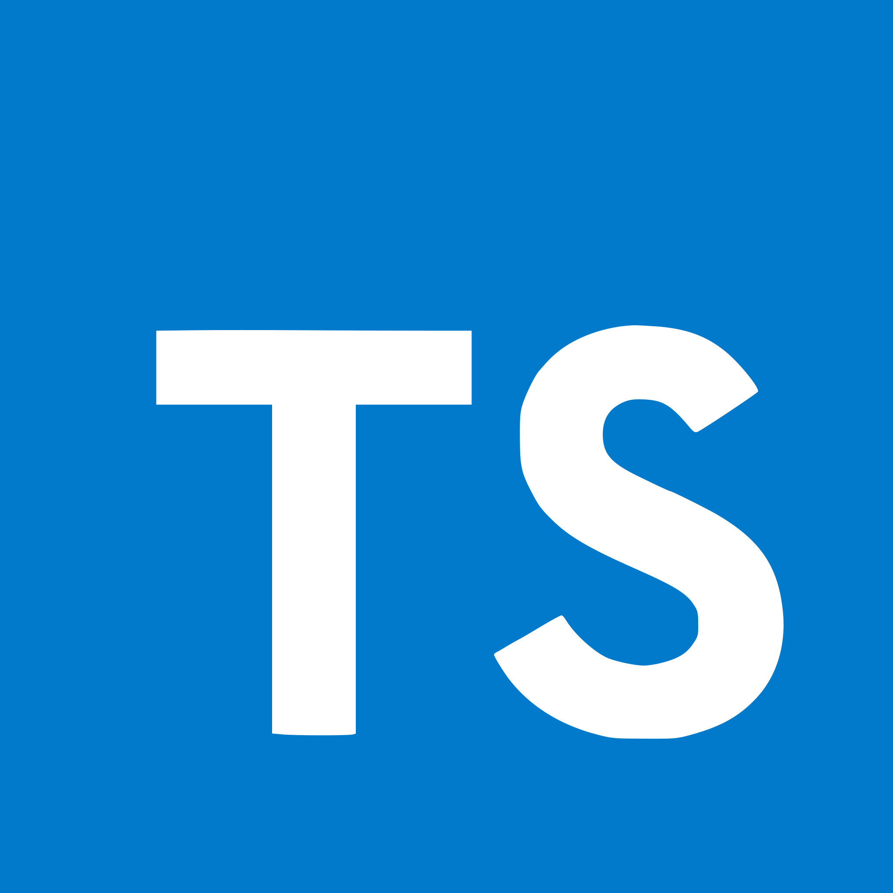

# Example Project Starter

<p float="left" style="display: flex; justify-content: space-evenly;">




</p>
<hr/>

A starter repo with all the developer tools you would require.

### Installation

```
npm install
```

To run with browser

```
npm run dev
```

To run with Tauri (you must also have ran the above command in a different process)

```
npm run dev:native
```

### List of tools:

1. React - state library
2. Typescript - superset of javascript containing type enforcement
3. Storybook - a tool to build UI components in a sandbox
4. Vite - a blazing fast bundler using esbuild
5. Tauri - a toolkit that helps developers make applications for the major desktop platforms
6. Prettier - an opinionated code formatter
7. Eslint - a static code linter
8. Vitest - Unit test runner with React Testing Library and Mock Service Worker
9. Playwright - e2e test runner

#### TODO:

10. Apollo - client for interfacing with graphql
11. React Hook Form - for easier forming
12. Husky - for pre push checking
13. SSR - server side rendering for SEO
14. Guided VS Code tour with codetour extension
